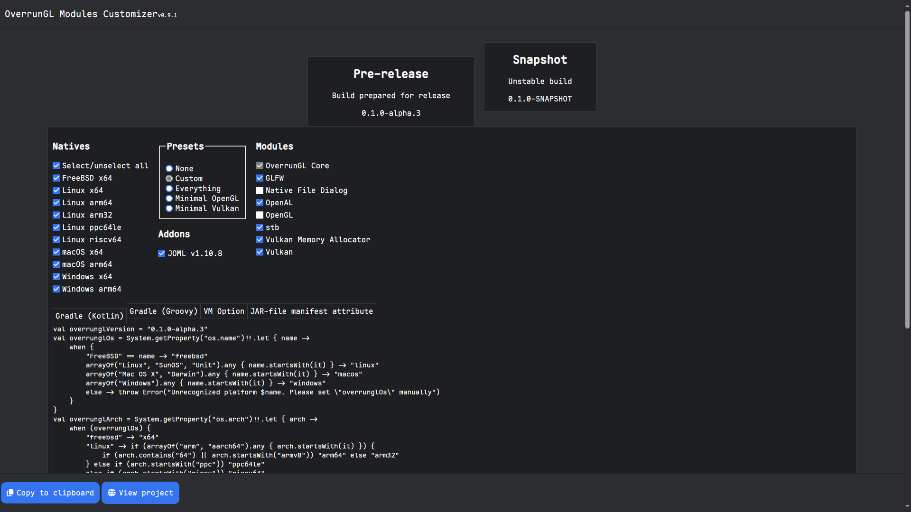
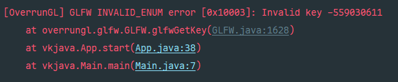

# 创建窗口

## 前置知识

我们先了解 FFM API 中有什么 API。

### 内存段

类名：`MemorySegment`

类似于 C 中的指针，内存段用于表示一段内存的地址和长度。不同的是，内存段**没有具体类型**，读写时都要手动指定内存布局。内存布局用于描述内存段的**内容**的布局，具体有哪些我们之后会提到。

### 段分配器

类名：`SegmentAllocator`

用于分配内存段。不指定初始化内容的情况下默认用0初始化。

### 竞技场分配器

类名：`Arena`

段分配器的默认实现，在堆上分配内存。`Arena`有4种类型，分别如下。

| 名称           | 作用域       | 能否手动关闭 | 跨线程访问 |
|--------------|-----------|--------|-------|
| `global`     | 整个程序的生命周期 | 否      | 是     |
| `ofConfined` | 关闭前       | 是      | 否     |
| `ofShared`   | 关闭前       | 是      | 是     |
| `ofAuto`     | 不定（GC 管理） | 否      | 是     |

能手动关闭的`Arena`**必须**关闭，否则会导致内存泄漏。此外，不要滥用 GC 管理的`Arena`，否则你的内存段被 GC 释放掉就成悬挂指针了。

### Downcall 和 Upcall

Downcall 指 Java 调用本机库函数。Upcall 指本机库调用 Java 方法。

特别地，OverrunGL 中 downcall 方法返回的内存段都是零长度的内存段（zero-length memory segments），需要通过`reinterpret`方法改掉它的长度。

Upcall 方法的参数都是零长度的内存段。OverrunGL 封装了`Upcall`类型，其中`stub(Arena)`方法用给定的`Arena`创建一个内存段，用于让本机库作为函数指针调用。

## 配置 JDK

当前版本的 OverrunGL 使用 JDK 24（之后会升到 25），因此我们在 [jdk.java.net](https://jdk.java.net/24/) 上下载一个并解压到你喜欢的位置。

## 创建项目

先创建一个 Gradle 项目 ~~（你都在看本教程了不会不知道怎么创建吧）~~ 。

打开[生成器](https://over-run.github.io/overrungl-gen/)，你应该看到以下页面：



我们选择 Minimal Vulkan，并勾上 Vulkan Memory Allocator 和 JOML。Natives 全选。

点击 Copy to clipboard，把内容粘贴到`build.gradle.kts`（或`build.gradle`）中。刷新项目。

/// admonition | 不知道怎么刷新项目？
    type: note
打开侧栏 Gradle，点击 Sync All Gradle Projects。
///

## 主类

创建`App`类作为程序的主逻辑，`Main`类作为入口点。

```java title="App.java"
public class App {
    private static final App INSTANCE = new App();

    private App() {
    }

    public void start() {
    }

    private void initVulkan() {
    }

    private void run() {
    }

    private void disposeVulkan() {
    }

    public void dispose() {
    }

    public static App getInstance() {
        return INSTANCE;
    }
}
```

```java title="Main.java"
public class Main {
    public static void main(String[] args) {
        App app = App.getInstance();
        try {
            app.start();
        } finally {
            app.dispose();
        }
    }
}
```

注意我们把`App`设计成单例的，这样我们之后就能从其他地方访问创建的 Vulkan 对象了。

## 窗口

我们用 GLFW 来创建窗口。

/// admonition | 为什么不用 SDL？
    type: question
OverrunGL 不支持。
///

在`INSTANCE`下方添加一个字段`window`用来保存窗口的地址。

```java hl_lines="2-4" title="App.java"
private static final App INSTANCE = new App();
private static final int WINDOW_WIDTH = 800;
private static final int WINDOW_HEIGHT = 600;
private MemorySegment window = MemorySegment.NULL;
```

有没有发现什么陌生的东西？如果你用过 LWJGL 3，你应该知道地址用`long`表示。而在这里第一次出现了 FFM API 的内容：`MemorySegment`，内存段。如果你不知道什么是内存段，[返回顶部](#)。

接下来就是常规的窗口创建了。先初始化 GLFW，设置窗口提示。

```java hl_lines="2-11" title="App.java"
public void start() {
    if (!glfwInit()) {
        throw new IllegalStateException("failed to initialize GLFW");
    }
    GLFWVidMode vidMode = GLFWVidMode.ofNative(glfwGetVideoMode(glfwGetPrimaryMonitor()));
    if (vidMode != null) {
        glfwWindowHint(GLFW_POSITION_X, (vidMode.width() - WINDOW_WIDTH) / 2);
        glfwWindowHint(GLFW_POSITION_Y, (vidMode.height() - WINDOW_HEIGHT) / 2);
    }
    glfwWindowHint(GLFW_RESIZABLE, GLFW_FALSE);
    glfwWindowHint(GLFW_CLIENT_API, GLFW_NO_API);
}
```

`GLFWVidMode::ofNative`方法会帮我们自动`reinterpret`并转换成适合我们操作的类型。当然如果你喜欢也可以这样：

```java
MemorySegment vidMode = glfwGetVideoMode(glfwGetPrimaryMonitor()).reinterpret(GLFWVidMode.LAYOUT.byteSize());
glfwWindowHint(GLFW_POSITION_X, (GLFWVidMode.width(vidMode, 0) - WINDOW_WIDTH) / 2);
glfwWindowHint(GLFW_POSITION_Y, (GLFWVidMode.height(vidMode, 0) - WINDOW_HEIGHT) / 2);
```

一般在需要极多次调用时才用静态方法，值类型发布了另说。

在 Vulkan 中改变窗口大小需要重建交换链，因此`GLFW_RESIZABLE`设置为`GLFW_FALSE`。

`GLFW_CLIENT_API`指定 OpenGL API。我们在用 Vulkan！因此设置为`GLFW_NO_API`。

接下来创建窗口。顺便调用 Vulkan 初始化方法。

```java hl_lines="2-8" title="App.java"
glfwWindowHint(GLFW_CLIENT_API, GLFW_NO_API);
window = glfwCreateWindow(WINDOW_WIDTH, WINDOW_HEIGHT, MemoryUtil.allocString("Hello world"), MemorySegment.NULL, MemorySegment.NULL);
if (MemoryUtil.isNullPointer(window)) {
    throw new IllegalStateException("failed to create GLFW window");
}

initVulkan();
run();
```

GLFW 会复制标题，所以我们偷懒用`MemoryUtil::allocString`来创建字符串。

保持窗口打开：

```java hl_lines="2-4" title="App.java"
private void run() {
    while (!glfwWindowShouldClose(window)) {
        glfwPollEvents();
    }
}
```

不要忘了释放资源。

```java hl_lines="2-4" title="App.java"
public void dispose() {
    disposeVulkan();
    glfwDestroyWindow(window);
    glfwTerminate();
}
```

运行`main`方法，我们应该看到一个空白的窗口。

## 错误回调

有时候我们可能会手误写错参数，这时 GLFW 的错误回调可以帮助我们找到问题。在`start`方法的开头添加以下代码：

```java hl_lines="2" title="App.java"
public void start() {
    glfwSetErrorCallback(GLFWErrorCallback.createPrint().stub(Arena.global()));
    // ...
}
```

`GLFWErrorCallback::createPrint`创建一个把信息打印到错误输出流的`GLFWErrorFun`。`GLFWErrorFun`属于`Upcall`。我们不打算释放它，因此用`Arena.global()`。

/// admonition | 不要用`Arena.ofAuto()`
    type: warning
GC 无法跟踪传递到本机库的内存段，会误认为内存段不再使用。当 GLFW 尝试调用回调时，其所指的内存可能已被释放，从而崩溃。
///

现在在窗口创建后调用代码测试回调是否正常工作。

```java hl_lines="5" title="App.java"
if (MemoryUtil.isNullPointer(window)) {
    throw new IllegalStateException("failed to create GLFW window");
}

glfwGetKey(window, 0xdeaddead);
```

运行代码，我们会看到这样的报错：



报错中包含了堆栈信息，能帮助我们定位出错的代码。
