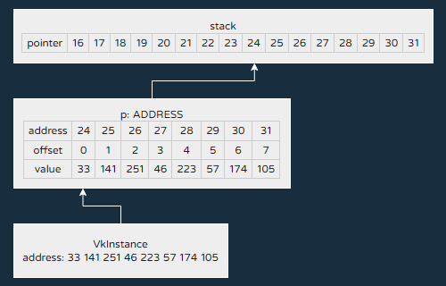

# 创建实例

我们来创建 Vulkan 实例。

添加一个字段保存`VkInstance`。

```java hl_lines="2" title="App.java"
private MemorySegment window = MemorySegment.NULL;
private VkInstance instance = null;
```

释放资源。

```java hl_lines="2-4" title="App.java"
private void disposeVulkan() {
    if (instance != null) {
        vkDestroyInstance(instance, MemorySegment.NULL);
    }
}
```

使用 Vulkan 的函数前需要先指定如何加载函数。在`initVulkan`中添加代码。

```java hl_lines="2" title="App.java"
private void initVulkan() {
    VK.create(GLFW::glfwGetInstanceProcAddress);
}
```

接下来就是重点了：**填充结构体**。

## 内存栈

我们不能每次都在堆上分配内存，那样会导致程序变卡。OverrunGL 引入了新的段分配器：`MemoryStack`。`MemoryStack`实际是把已分配的内存切片，这样我们就不必反复分配少量内存。

创建`createInstance`方法。

```java hl_lines="3 6-9" title="App.java"
private void initVulkan() {
    // ...
    createInstance();
}

private void createInstance() {
    try (MemoryStack stack = MemoryStack.pushLocal()) {
    }
}
```

## 结构体

OverrunGL 封装了结构体以便我们读写。

在栈上创建一个`VkApplicationInfo`。

```java hl_lines="2-8" title="App.java"
try (MemoryStack stack = MemoryStack.pushLocal()) {
    var applicationInfo = VkApplicationInfo.alloc(stack)
        .sType(VK_STRUCTURE_TYPE_APPLICATION_INFO)
        .pApplicationName(stack.allocateFrom("Vulkan in Java"))
        .applicationVersion(VK_MAKE_API_VERSION(0, 1, 0, 0))
        .pEngineName(stack.allocateFrom("No Engine"))
        .engineVersion(VK_MAKE_API_VERSION(0, 0, 0, 1))
        .apiVersion(VK_API_VERSION_1_0);
}
```

只有`apiVersion`重要，其他的可以无视。

然后创建`VkInstanceCreateInfo`。

```java hl_lines="2-8" title="App.java"
var applicationInfo = ...;
var createInfo = VkInstanceCreateInfo.alloc(stack)
    .sType(VK_STRUCTURE_TYPE_INSTANCE_CREATE_INFO)
    .pApplicationInfo(applicationInfo.segment())
    .enabledLayerCount(0)
    .ppEnabledLayerNames(MemorySegment.NULL)
    .enabledExtensionCount(0)
    .ppEnabledExtensionNames(MemorySegment.NULL);
```

`pApplicationInfo`需要传入`applicationInfo`的地址。这里`ppEnabledLayerNames`和`ppEnabledExtensionNames`留着备用。

## 内存布局

前面提到内存布局描述内存段的**内容**的布局。FFM API 自带了以下几种布局：

| 布局                       | 值类型           | C 类型      |
|--------------------------|---------------|-----------|
| ValueLayout.JAVA_BOOLEAN | boolean       | char      |
| ValueLayout.JAVA_CHAR    | char          | short     |
| ValueLayout.JAVA_BYTE    | byte          | char      |
| ValueLayout.JAVA_SHORT   | short         | short     |
| ValueLayout.JAVA_INT     | int           | int       |
| ValueLayout.JAVA_LONG    | long          | long long |
| ValueLayout.JAVA_FLOAT   | float         | float     |
| ValueLayout.JAVA_DOUBLE  | double        | double    |
| ValueLayout.ADDRESS      | MemorySegment | void*     |

除此之外，OverrunGL 封装的结构体包含一个`LAYOUT`字段，描述结构体的布局。

现在创建实例。

```java hl_lines="2-4" title="App.java"
var createInfo = ...;
var p = stack.allocate(ValueLayout.ADDRESS);
vkCreateInstance(createInfo.segment(), MemorySegment.NULL, p);
instance = new VkInstance(p.get(ValueLayout.ADDRESS, 0));
```

首先创建布局为`ADDRESS`的临时内存`p`，用于保存一个`MemorySegment`。我们通过`get`方法获取本机库返回的值。

/// admonition | 注意
    type: warning
`p`只负责保存 Vulkan 实例的地址，`get`方法才真正获取实例的地址。
///



## Util

每次都要创建临时内存实在太麻烦了，有没有简便方法呢？**没有。**但是，我们可以封装代码。

创建`VkUtil`类。`acquireAddress`用于获取地址。`acquireLong`之后会用上。

```java title="VkUtil.java"
public class VkUtil {
    private VkUtil() {
    }

    public static void check(String message, int result) {
        if (result != VK_SUCCESS) {
            throw new IllegalStateException(result + ": " + message);
        }
    }

    public static MemorySegment acquireAddress(String message, ToIntFunction<MemorySegment> func) {
        try (MemoryStack stack = MemoryStack.pushLocal()) {
            var p = stack.allocate(ValueLayout.ADDRESS);
            check(message, func.applyAsInt(p));
            return p.get(ValueLayout.ADDRESS, 0);
        }
    }

    public static int acquireInt(String message, ToIntFunction<MemorySegment> func) {
        try (MemoryStack stack = MemoryStack.pushLocal()) {
            var p = stack.allocate(ValueLayout.JAVA_INT);
            check(message, func.applyAsInt(p));
            return p.get(ValueLayout.JAVA_INT, 0);
        }
    }

    public static long acquireLong(String message, ToIntFunction<MemorySegment> func) {
        try (MemoryStack stack = MemoryStack.pushLocal()) {
            var p = stack.allocate(ValueLayout.JAVA_LONG);
            check(message, func.applyAsInt(p));
            return p.get(ValueLayout.JAVA_LONG, 0);
        }
    }
}
```

现在修改创建实例的代码。

```java hl_lines="2-4" title="App.java"
var createInfo = ...;
instance = new VkInstance(VkUtil.acquireAddress("failed to create instance",
    p -> vkCreateInstance(createInfo.segment(), MemorySegment.NULL, p)
));
```

## 验证层

Vulkan SDK 自带的验证层能帮助我们调试代码。

修改`App.java`。

```java hl_lines="2-3" title="App.java"
private static final App INSTANCE = new App();
private static final boolean ENABLE_VALIDATION_LAYERS = true;
private static final String[] VALIDATION_LAYERS = {"VK_LAYER_KHRONOS_validation"};
```

检查是否支持验证层。我们用`MemoryUtil::nativeString`把内存段转换成字符串。

```java hl_lines="27-29" title="App.java"
private boolean isValidationLayersSupported() {
    try (MemoryStack stack = MemoryStack.pushLocal()) {
        int layerCount = VkUtil.acquireInt("failed to get instance layer property count",
            p -> vkEnumerateInstanceLayerProperties(p, MemorySegment.NULL)
        );
        var properties = VkLayerProperties.alloc(stack, layerCount);
        VkUtil.check("failed to enumerate instance layer properties",
            vkEnumerateInstanceLayerProperties(stack.ints(layerCount), properties.segment()));
        for (String layer : VALIDATION_LAYERS) {
            boolean found = false;
            for (int i = 0; i < layerCount; i++) {
                if (layer.equals(MemoryUtil.nativeString(properties.layerNameAt(i)))) {
                    found = true;
                    break;
                }
            }
            if (!found) {
                System.err.println("couldn't find layer " + layer);
                return false;
            }
        }
        return true;
    }
}

private void createInstance() {
    if (ENABLE_VALIDATION_LAYERS && !isValidationLayersSupported()) {
        throw new IllegalStateException("requested validation layers but is not found");
    }
    // ...
}
```

更新`VkInstanceCreateInfo`。用`MemoryUtil::allocArray`创建字符串数组。

```java hl_lines="3-4" title="App.java"
var createInfo = VkInstanceCreateInfo.alloc(stack)
    // ...
    .enabledLayerCount(ENABLE_VALIDATION_LAYERS ? VALIDATION_LAYERS.length : 0)
    .ppEnabledLayerNames(ENABLE_VALIDATION_LAYERS ? MemoryUtil.allocArray(stack, VALIDATION_LAYERS) : MemorySegment.NULL)
    // ...
    ;
```

## 实例扩展

继续修改`App.java`。

```java hl_lines="5-42 49-52 59-60" title="App.java"
private boolean isValidationLayersSupported() {
    // ...
}

private List<String> getInstanceExtensions() {
    List<String> list = new ArrayList<>();
    try (MemoryStack stack = MemoryStack.pushLocal()) {
        MemorySegment pCount = stack.allocate(ValueLayout.JAVA_INT);
        MemorySegment extensions = glfwGetRequiredInstanceExtensions(pCount);
        int count = pCount.get(ValueLayout.JAVA_INT, 0);
        MemorySegment reinterpret = extensions.reinterpret(ValueLayout.ADDRESS.scale(0, count));
        for (int i = 0; i < count; i++) {
            list.add(MemoryUtil.nativeString(reinterpret.getAtIndex(ValueLayout.ADDRESS, i)));
        }
    }
    if (ENABLE_VALIDATION_LAYERS) {
        list.add(VK_EXT_DEBUG_UTILS_EXTENSION_NAME);
    }

    try (MemoryStack stack = MemoryStack.pushLocal()) {
        int extCount = VkUtil.acquireInt("failed to get instance extension count",
            p -> vkEnumerateInstanceExtensionProperties(MemorySegment.NULL, p, MemorySegment.NULL));
        var properties = VkExtensionProperties.alloc(stack, extCount);
        VkUtil.check("failed to enumerate instance extension properties",
            vkEnumerateInstanceExtensionProperties(MemorySegment.NULL, stack.ints(extCount), properties.segment()));
        for (String extName : list) {
            boolean found = false;
            for (int i = 0; i < extCount; i++) {
                if (extName.equals(MemoryUtil.nativeString(properties.extensionNameAt(i)))) {
                    found = true;
                    break;
                }
            }
            if (!found) {
                System.err.println("couldn't find extension " + extName);
                return List.of();
            }
        }
    }

    return list;
}

private void createInstance() {
    if (ENABLE_VALIDATION_LAYERS && !isValidationLayersSupported()) {
        throw new IllegalStateException("requested validation layers but is not found");
    }

    List<String> instanceExtensions = getInstanceExtensions();
    if (instanceExtensions.isEmpty()) {
        throw new IllegalStateException("required instance extensions not found");
    }
    // ...

    try (MemoryStack stack = MemoryStack.pushLocal()) {
        // ...
        var createInfo = VkInstanceCreateInfo.alloc(stack)
            // ...
            .enabledExtensionCount(ENABLE_VALIDATION_LAYERS ? instanceExtensions.size() : 0)
            .ppEnabledExtensionNames(ENABLE_VALIDATION_LAYERS ? MemoryUtil.allocArray(stack, instanceExtensions.toArray(String[]::new)) : MemorySegment.NULL);
        // ...
    }
}
```

## 调试信使

调试信使可以输出供调试用的信息。

创建`VkDebugMessenger`类。

```java title="VkDebugMessenger.java"
public class VkDebugMessenger {
    private static final MemorySegment UPCALL_STUB = VkDebugUtilsMessengerCallbackEXT.alloc(Arena.global(), VkDebugMessenger::callback);
    private VkInstance instance = null;
    private long handle = VK_NULL_HANDLE;

    private static int callback(
        int messageSeverity,
        int messageTypes,
        MemorySegment pCallbackData/* (1)! */,
        MemorySegment pUserData
    ) {
        String message = MemoryUtil.nativeString(VkDebugUtilsMessengerCallbackDataEXT.pMessage(pCallbackData.reinterpret(VkDebugUtilsMessengerCallbackDataEXT.LAYOUT.byteSize()), 0));
        switch (messageSeverity) {
            case VK_DEBUG_UTILS_MESSAGE_SEVERITY_VERBOSE_BIT_EXT -> System.err.println("DM TRACE: " + message);
            case VK_DEBUG_UTILS_MESSAGE_SEVERITY_INFO_BIT_EXT -> System.err.println("DM INFO : " + message);
            case VK_DEBUG_UTILS_MESSAGE_SEVERITY_WARNING_BIT_EXT -> System.err.println("DM WARN : " + message);
            case VK_DEBUG_UTILS_MESSAGE_SEVERITY_ERROR_BIT_EXT -> System.err.println("DM ERROR: " + message);
        }
        return VK_FALSE;
    }

    public static VkDebugUtilsMessengerCreateInfoEXT createInfo(SegmentAllocator allocator) {
        return VkDebugUtilsMessengerCreateInfoEXT.alloc(allocator)
            .sType(VK_STRUCTURE_TYPE_DEBUG_UTILS_MESSENGER_CREATE_INFO_EXT)
            .messageSeverity(VK_DEBUG_UTILS_MESSAGE_SEVERITY_VERBOSE_BIT_EXT
                | VK_DEBUG_UTILS_MESSAGE_SEVERITY_WARNING_BIT_EXT
                | VK_DEBUG_UTILS_MESSAGE_SEVERITY_ERROR_BIT_EXT)
            .messageType(VK_DEBUG_UTILS_MESSAGE_TYPE_GENERAL_BIT_EXT
                | VK_DEBUG_UTILS_MESSAGE_TYPE_VALIDATION_BIT_EXT
                | VK_DEBUG_UTILS_MESSAGE_TYPE_PERFORMANCE_BIT_EXT)
            .pfnUserCallback(UPCALL_STUB);
    }

    public void create(VkInstance instance) {
        this.instance = instance;
        try (MemoryStack stack = MemoryStack.pushLocal()) {
            var createInfo = createInfo(stack);
            handle = VkUtil.acquireLong("failed to create debug utils messenger",
                p -> vkCreateDebugUtilsMessengerEXT(instance, createInfo.segment(), MemorySegment.NULL, p));
        }
    }

    public void destroy() {
        if (instance != null) {
            vkDestroyDebugUtilsMessengerEXT(instance, handle, MemorySegment.NULL);
        }
    }

    public VkInstance instance() {
        return instance;
    }

    public long handle() {
        return handle;
    }
}
```

1. 使用静态方法访问，必须修改内存段的大小！

再修改`App.java`。

```java hl_lines="2 7-9 19 27-29" title="App.java"
private VkInstance instance = null;
private final VkDebugMessenger debugMessenger = new VkDebugMessenger();

private void initVulkan() {
    VK.create(GLFW::glfwGetInstanceProcAddress);
    createInstance();
    if (ENABLE_VALIDATION_LAYERS) {
        debugMessenger.create(instance);
    }
}

private void createInstance() {
    // ...

    try (MemoryStack stack = MemoryStack.pushLocal()) {
        // ...
        var createInfo = VkInstanceCreateInfo.alloc(stack)
            .sType(VK_STRUCTURE_TYPE_INSTANCE_CREATE_INFO)
            .pNext(ENABLE_VALIDATION_LAYERS ? VkDebugMessenger.createInfo(stack).segment() : MemorySegment.NULL)
            // ...
        ;
        // ...
    }
}

private void disposeVulkan() {
    if (ENABLE_VALIDATION_LAYERS && debugMessenger != null) {
        debugMessenger.destroy();
    }
    // ...
}
```
