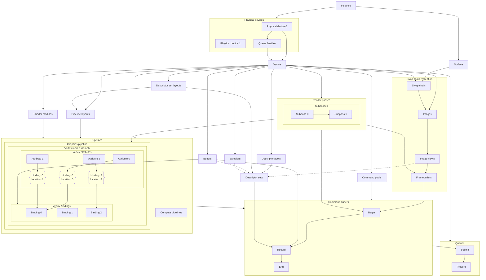

# Vulkan in Java

众所周知，Java 不适合编写游戏（Minecraft：？）。然而在 C++ 中处理字符串和内存之类的实在太痛苦，所以我编写了这套教程来教你如何结合 Java 的 [FFM API](https://openjdk.org/jeps/454) 使用 Vulkan，从而提高程序的运行效率。

本教程重点关注：

1. 利用 FFM API 实现与本机函数的交互
2. OverrunGL 一些 API 的用法

至于 Vulkan 中的概念就看其他教程吧。

本教程源码可在[这里](https://github.com/squid233/vulkan-in-java-src)找到。

## 啥是 OverrunGL？

请看[这里](https://github.com/Over-Run/overrungl)。简单来说就是像 LWJGL 一样能让你调用 C 函数的库。

## 参考资料

- [OverrunGL Javadoc](https://over-run.github.io/overrungl)
- [Vulkan References](https://registry.khronos.org/vulkan/specs/latest/man/html/)
- [Vulkan Tutorial](https://vulkan-tutorial.com/Introduction)：英文教程
- [EasyVulkan](https://easyvulkan.github.io/)：中文教程

